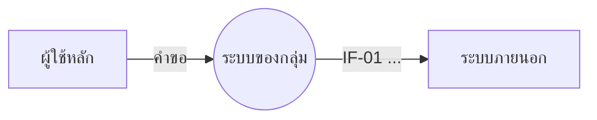
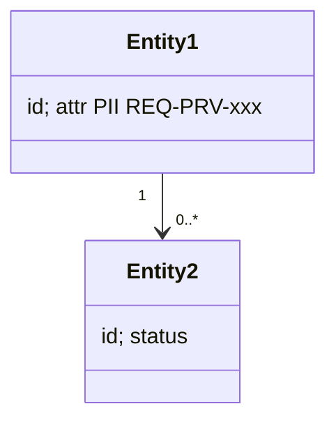
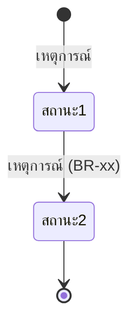
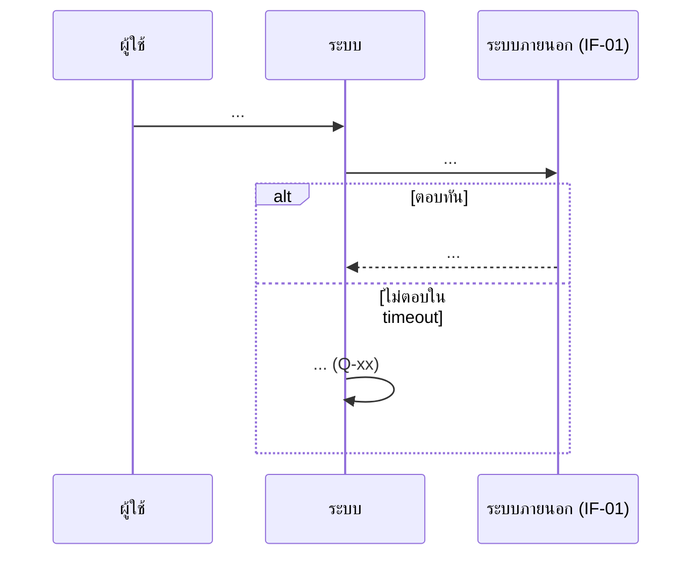

# โมเดลที่ feature นี้ใช้ (MD-CTX-xx, MD-DOM-xx, MD-STM-xx, MD-SEQ-xx)

เวอร์ชัน 1.0 เข้า Baseline B1 | เขียนด้วย Mermaid เปิดดูภาพได้บน GitHub
แปลงจากภาพในบทเรียน Integrated Requirements Modelling ของกลุ่ม
ตัวอย่าง: github.com/ppsajja/baanprom-swreqspec/blob/main/specs/002-booking/models.md

## MD-CTX-xx Context Diagram (เฉพาะส่วนที่ feature นี้แตะ)

## MD-DOM-xx Domain Model

## MD-STM-xx วงจรชีวิตของ <entity หลัก>

## MD-SEQ-xx ลำดับการคุยกับระบบภายนอก (ขั้นที่มี exception)

